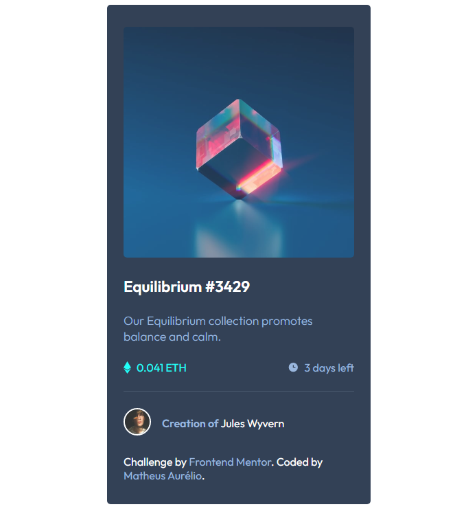
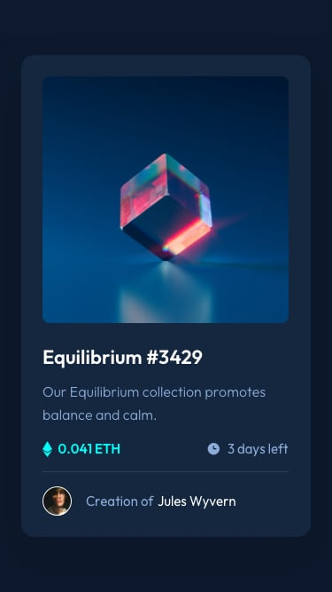
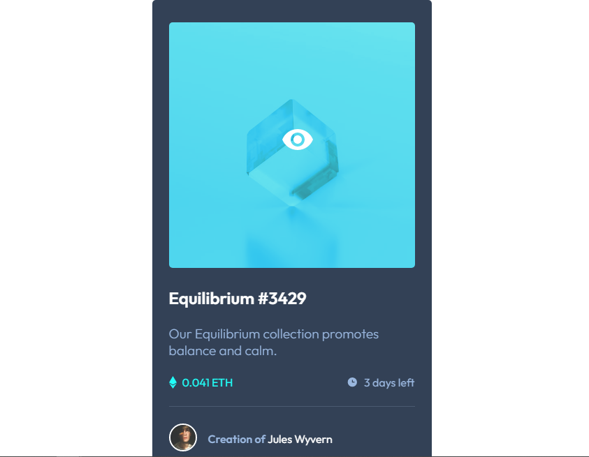

# Frontend Mentor - NFT preview card component

## Bem vindo! 👋

Desafio proposto pelo [Frontend Mentor](https://www.frontendmentor.io).

## Resultado

- Desktop

- Mobile

- Hover

## Sobre

Trata-se de um card simples contendo algumas pequenas interatividades com o usuário ao passar o mouse na imagem, uso de flexbox, grid layout e etc.

## Guia para fazer o desafio

- [style-guide](style-guide.md).

**Let's to fly!** 🚀